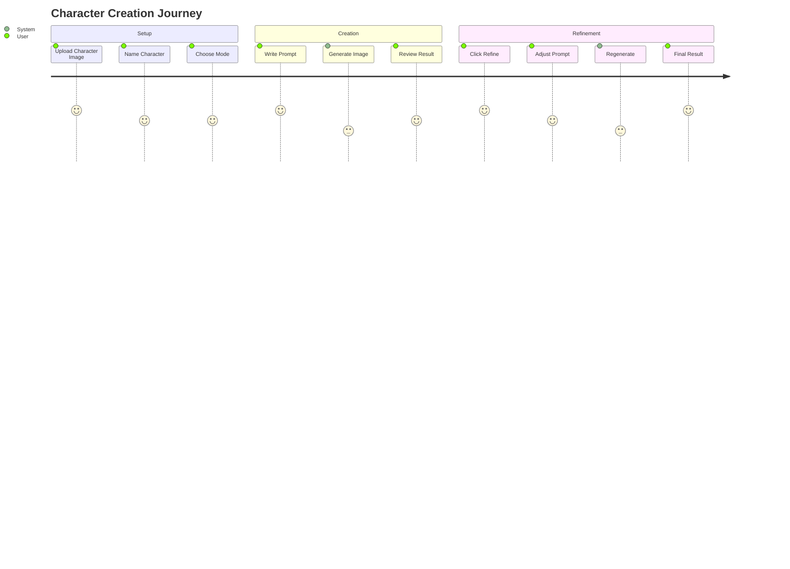

# CharacterCraft Pro 🎭

[](https://opensource.org/licenses/MIT)
[](https://ai.google.dev/)
[]()


An AI-powered character consistency platform that leverages the **Gemini 2.5 Flash Image Preview (Nano Banana)** model to maintain perfect character identity across unlimited scenarios and contexts.

CharacterCraft Pro solves the "holy grail" problem of AI image generation: maintaining exact character identity while dramatically changing environments, poses, lighting, and art styles.

---

## ✨ Key Features

- **🎯 Perfect Character Consistency**: Preserves exact facial features, body proportions, and clothing details across all generations
- **🎨 Creative Studio**: Place your character in any scenario you can imagine with a simple text prompt
- **🌌 Fusion Engine**: Seamlessly blend your character with separate images for background and artistic style
- **✨ Intelligent Variations**: Generate multiple, artistically diverse versions of your prompt in a single click to explore different creative directions
- **🔄 Rapid Refinement**: Instantly load any generated image's prompt back into the controls to iterate and perfect your creation
- **✏️ Text Overlay**: Easily add text to your images directly through the prompt for memes or story panels
- **🚀 Demo Scenarios**: Kickstart your creativity with a showcase of pre-built prompts
- **🛡️ Robust & Stable**: Features built-in concurrency limiting to ensure smooth generation, even for large batches of images

---

## 🚀 Live Demo

[](https://youtu.be/rPISvyEFzcE?si=S5fnPlredt-cA7jL)

**Watch the demo on YouTube**: [https://youtu.be/rPISvyEFzcE](https://youtu.be/rPISvyEFzcE?si=S5fnPlredt-cA7jL)

---

## 🛠️ Tech Stack

- **Frontend**: [React](https://reactjs.org/), [TypeScript](https://www.typescriptlang.org/)
- **Styling**: [Tailwind CSS](https://tailwindcss.com/)
- **AI Engine**: [Google Gemini API](https://ai.google.dev/)
  - **Model**: `gemini-2.5-flash-image-preview` (also known as Nano Banana)

---

## 📧 Getting Started

### Prerequisites

- A modern web browser (Chrome, Firefox, Safari, Edge)
- A Google Gemini API Key. You can get one from [Google AI Studio](https://aistudio.google.com/app/apikey)

### Installation & Setup

1. **Clone the repository:**
   ```bash
   git clone https://github.com/VIKAS9793/charactercraft-pro.git
   cd charactercraft-pro
   ```

2. **Configure Environment Variables:**
   
   This project requires a Google Gemini API key to function. The application is configured to read this key from an environment variable named `API_KEY`.

   You must set this variable in the environment where you run the application. For example, in a `.env` file or directly in your deployment service (like Vercel, Netlify, or Google AI Studio's secrets).

   ```bash
   # .env
   API_KEY="YOUR_GEMINI_API_KEY_HERE"
   ```

3. **Run the application:**
   
   Follow the instructions for your development environment (e.g., `npm install && npm start`).

---

## 📖 Usage

### Workflow Overview



### Step-by-Step Process

1. **Upload Character**: On the welcome screen, provide a name for your character and upload a clear reference image

2. **Choose Your Mode**:
   - **Creative Mode**: Write a prompt describing a new scene (e.g., "standing on a mountain summit at sunset")
   - **Fusion Mode**: Switch to Fusion Mode and upload separate images for the background and an optional style/lighting reference

3. **Generate**:
   - Click **Generate** for a single creation
   - In Creative Mode, use the **Intelligent Variations** buttons (Generate x2, Generate x4) to explore multiple artistic styles at once

4. **Iterate**: Click the **Refine** icon on any generated image. This loads its original prompt back into the control center, allowing you to make quick edits and regenerate

---

## 🤖 Gemini API Integration

The core of this application's power comes from the `gemini-2.5-flash-image-preview` model.

- **Service File**: All API logic is managed in `src/services/geminiService.ts`
- **API Call**: The `generateConsistentCharacter` function constructs a multimodal request, sending a combination of image parts and a text prompt to the Gemini API
- **Prompt Architecture**: The application relies on a sophisticated prompt engineering strategy. It forges a single, highly-descriptive text prompt that clearly instructs the model on its task (e.g., placing a character in a new scene or fusing multiple images). This clear instruction, combined with the reference images, is sent as the main `contents` of the request

```typescript
// From services/geminiService.ts
const response = await ai.models.generateContent({
  model: 'gemini-2.5-flash-image-preview',
  contents: { parts: contentParts }, // Contains images and a detailed instructional prompt
  config: {
    responseModalities: [Modality.IMAGE, Modality.TEXT],
  },
});
```

---

## 🧬 Project Architecture

This project is built on a deterministic **Prompt Protocol Engine** philosophy. The goal is to translate user intent into highly structured instructions for the AI, minimizing randomness and maximizing character consistency.

This approach ensures that every generation is precise and controlled. For a deeper dive into the application's design philosophy, UI/UX framework, and advanced prompt engineering strategies, please see [ARCHITECTURE.md](ARCHITECTURE.md).

---

## 🤝 Contribution Guidelines

Contributions are welcome! Please see the [CONTRIBUTING.md](CONTRIBUTING.md) file for guidelines on how to get started.

---

## 🧪 Testing

> **Note**: This section is a placeholder as no testing framework is currently configured.

To run tests, you would typically use a command like:

```bash
npm test
```

Please add relevant tests for any new features or bug fixes you contribute.

---

## 📜 License

This project is licensed under the **MIT License**.

---

## 📬 Contact & Support

**Owner**: Vikas Sahani

- **Email**: [vikassahani17@gmail.com](mailto:vikassahani17@gmail.com)
- **LinkedIn**: [linkedin.com/in/vikas-sahani-727420358](https://www.linkedin.com/in/vikas-sahani-727420358)